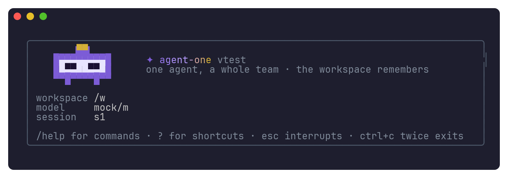
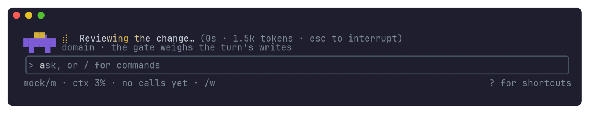
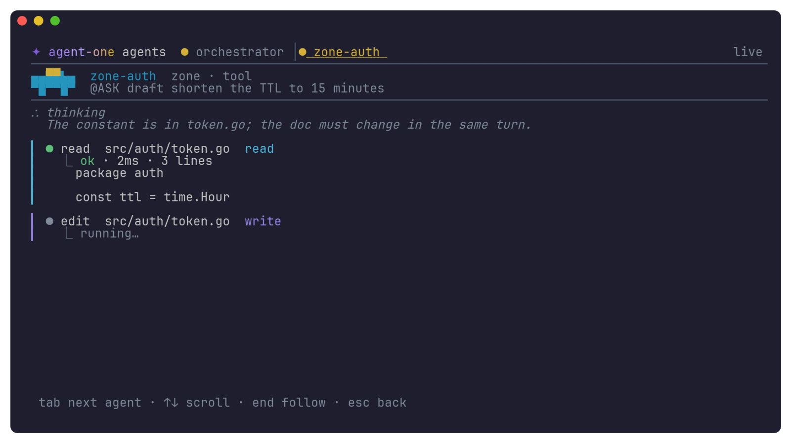
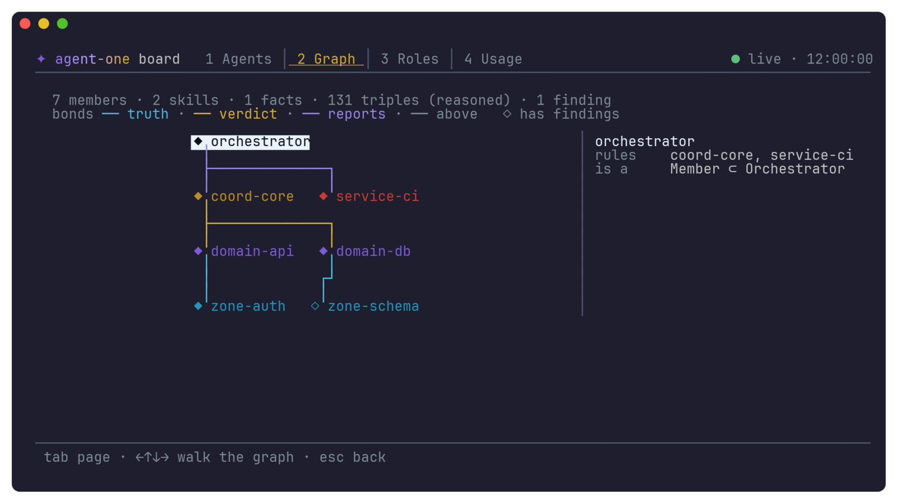
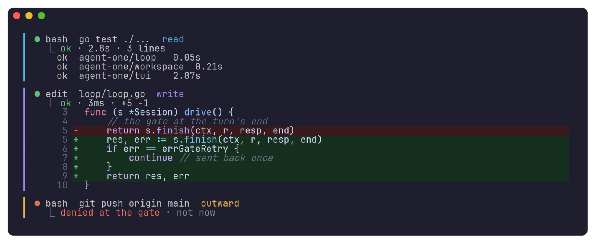

<p align="center"></p>

<h1 align="center">Agent-One</h1>

<p align="center"><b>A coding-agent harness that enforces its policies in code.</b><br>
One static Go binary. Review gates, an append-only change log, human approval for risky actions,
a sandboxed shell and native memory are part of the runtime — not instructions the model may
ignore.</p>

---

## Why

Agents read a project's rules and then, sometimes, don't follow them. Agent-One turns a directory
into a **workspace** governed by [`AGENT-ONE.md`](AGENT-ONE.md) and runs the agent inside it:

- **Review gate** — every turn that changed the workspace is checked before it's reported done:
  the owning member made the change, its invariants hold, the requested work is complete, and the
  owning doc changed with the code. The verdict is appended to `log.md`.
- **Human approval** — every action is classified (`read` · `write` · `outward` ·
  `destructive`) before it runs. Outward and destructive actions ask you; per-command rules
  (`bash:git push*` → allow / ask / deny) tune it. A model can only make a classification stricter.
- **Sandbox** — `bash` runs in a persistent shell under `bwrap`: read-only filesystem except the
  workspace, no network unless the action was approved as outward, secrets stripped from the env.
- **Native memory** — recall before every step, record after; knowledge the agent held but never
  wrote down is surfaced and filed. When the context window fills, it is **drained** to memory by
  reference instead of being summarized away.
- **Roles and model routing** — the orchestrator dispatches ephemeral subagents to coordinators,
  domain owners and zone workers; the analyst, judge and drafter roles can each run on their own
  model (a cheap model to read, a strong one to judge).
- **Everything on, configuration takes away** — every tool, policy and instrument can be switched
  off in YAML or JSON, and a disabled policy is always reported, never silent.

## Install

```sh
curl -fsSL -o install.sh https://raw.githubusercontent.com/Kaginari/agent-one/main/install.sh
sh install.sh                     # downloads the release for your OS and checks it against checksums.txt
# or
go install github.com/Kaginari/agent-one/cmd/agent-one@latest
```

Release archives for linux/macOS × amd64/arm64 ship with `checksums.txt` and build provenance:
`gh attestation verify <archive> --repo Kaginari/agent-one`. A container image to try the binary:
`docker run --rm -it -e ANTHROPIC_API_KEY -v "$PWD:/work" ghcr.io/kaginari/agent-one:latest` — the
binary alone on Debian slim (no bubblewrap, git or toolchains); for real work in a container use
`--containered`, which builds a runtime with them.

**Requirements.** Linux or macOS. `bubblewrap` (`bwrap`) for the sandboxed shell on Linux — without it
the shell runs unsandboxed and `status` says so; macOS has no bwrap. Docker for `--containered`.

**Data boundary.** No telemetry. The binary contacts only the providers you configure (and the
package or container registries you name); any other network act is `outward` and asks you, and the
sandboxed shell has no network unless an `outward` act was approved.

## Quick start

```sh
cd your-project
agent-one init                    # onboard: .agent-one/ with the policies and a config
export ANTHROPIC_API_KEY=…         # or any OpenAI-compatible endpoint (vLLM, Ollama, OpenRouter)
agent-one                         # the live session — the dashboard opens at http://127.0.0.1:7411
agent-one run "add a health check endpoint and its test"
```

## The terminal

A terminal UI in the class of Claude Code: the conversation flows into your scrollback, and every
event of the loop is drawn — thinking, tool calls, diffs, subagents, the review gate.



Each role has a robot in its colour beside the spinner; when a turn changed files, the domain owner
reviews the change before the turn is done:



`ctrl+t` watches every agent — the orchestrator and each subagent, its thinking and its steps, live:



`/board` shows the workspace full screen — the agents, the ownership graph, the roles, the usage:





| Key | |
|---|---|
| `enter` · `shift+enter` | send · newline |
| `/` · `ctrl+k` | commands · the palette |
| `ctrl+t` | every agent, live |
| `ctrl+o` | expand the last folded block |
| `esc` | interrupt the turn |

## The CLI

| Command | What it does |
|---|---|
| `agent-one` / `repl` | the live session: keep talking while subagents work; `/agents`, `/send`, `/usage`, `/status`, `/compact` |
| `run "<task>"` | one task to completion, non-interactive; `--json` for automation |
| `resume <id>` · `sessions` | continue or list sessions |
| `status` | every live reading (models, sandbox, guard, memory) and every policy switched off, with where — gaps print as `@?` lines |
| `config show\|explain\|check\|path\|patch` | the effective configuration with the origin of every value |
| `memory` · `toolbox` · `onto` | memory tiers, the two-level tool registry, the ownership graph |
| `usage` | tokens and cost by agent, role, model and day |
| `bench` | a fixed task set on every configured model |
| `goal --validate "<cmd>" "<objective>"` | work turn after turn until the command passes; the binary runs it, the model cannot skip it |
| `review [range]` | two reviewers on two models in parallel, one merged shortlist; nothing fixed before you approve |
| `handoff [focus]` | a handoff note for a fresh session (`/handoff read` picks it up) |
| `guard check\|test\|show\|export\|hook\|install` | the global dangerous-command guard; `install --yes` wires it into Claude Code and OpenCode |
| `ui init\|scan\|check` | web pages built from one token system: lay the foundation, regenerate the legend, lint and screenshot at 360/768/1280 in both themes |
| `dash [--open]` | the session in the browser: the console, the neural net, metrics, relations; approvals answered there |
| `board` | the board and a read-only dashboard without a session, on 127.0.0.1 |
| `--containered` | the whole binary in a Docker container: the workspace read-write, the rest read-only |
| `selftest` · `version` · `init` | |

## Configuration

Configuration is YAML (or JSON), layered — each layer overrides the one before it:

| Layer | Where | Kept in git |
|---|---|---|
| built-in defaults | in the binary — everything on | — |
| global | `~/.config/agent-one/` | no |
| project | `.agent-one/` in the workspace | yes |
| project local | `.agent-one/config.local.yaml` | no (machine-only) |
| environment | `AGENT_ONE_CONFIG=<file>`, `AGENT_ONE_CONFIG_CONTENT=<yaml>`, `AGENT_ONE_MODEL`, `AGENT_ONE_DISABLE_PROJECT_CONFIG=1` (skip the project layers), `AGENT_ONE_PROVIDER_<NAME>_API_KEY` (built-in provider names only; a custom provider uses `apiKeyEnv`) | — |
| flags | `--model`, `--set key=value`, `--approve outward`, `--dry-run`, `--no-<feature>` | — |

`agent-one config explain` shows every effective value and the file and line it came from;
`agent-one status` shows every model, the guard, the sandbox and anything switched off.

### One file per part

A layer can be one `config.yaml`, or split: beside it, a file named after a section holds just that
section. The example in [`examples/gateway/`](examples/gateway/) — agent-one on vLLM-hosted models
behind a gateway — is laid out this way:

```
.agent-one/
├── config.yaml        # the workspace's own settings
├── providers.yaml     # model endpoints
├── registry.yaml      # models, tools, package and container registries
├── models.yaml        # who runs on what
├── guards.yaml        # catastrophic commands, refused before any approval
├── rules.yaml         # rules every agent reads, optionally checked at the gate
└── permissions.yaml   # ask / allow / deny per command
```

**`providers.yaml`** — where the models are. Keys are named, never written:

```yaml
gateway:
  enabled: true
  type: openai                       # any OpenAI-compatible endpoint: vLLM, a gateway, OpenRouter, Ollama
  baseURL: https://llm-gateway.example.corp/v1
  apiKeyEnv: GATEWAY_API_KEY         # the variable's name; export the key in your shell
  toolCalls: native                  # vLLM with --enable-auto-tool-choice; "text" for tags in the text
  contextWindow: auto                # read from /v1/models (max_model_len)
  timeout: 10m
  # headers: { X-Tenant: platform }        # a routing header; a credential here is refused
  # tls: { caFile: /etc/ssl/certs/corp-ca.pem }
```

`contextWindow: auto` reads the served maximum from `/v1/models`; a gateway that does not report it
needs `contextWindow: <n>` here or per model in `registry.yaml`. (A provider named `vllm` needs no
`type`: it is known.)

**`registry.yaml`** — where things come from: the models a gateway serves, the tools the agent can
discover, a private Artifactory, the container registry (the example ships `packages` and `containers`
commented out):

```yaml
models:                                     # "<provider>/<id>" — tier orders the roles; price in USD per 1M tokens
  gateway/muse-glimmer: { tier: 1, contextWindow: 131072, price: { input: 0, output: 0 } }
  gateway/glm-5-3:      { tier: 2 }
  gateway/kimi-k3:      { tier: 3 }
tools:                                      # external tools the toolbox indexes
  - { name: kubectl, description: "the cluster CLI", triggers: [kube, pods, deploy] }
packages:                                   # set in every shell command and in the container
  npm: https://artifactory.example.corp/artifactory/api/npm/npm-remote/
  pip: https://artifactory.example.corp/artifactory/api/pypi/pypi-remote/simple
  go:  https://artifactory.example.corp/artifactory/api/go/go-remote
  tokenEnv: ARTIFACTORY_TOKEN               # let through by name — the agent can read it: use a read-only token
  env: { GONOSUMDB: example.corp }
containers:                                 # for --containered
  base: artifactory.example.corp/docker-remote/debian:bookworm-slim
  apt:  https://artifactory.example.corp/artifactory/debian-remote
  # image: artifactory.example.corp/docker-local/agent-one-runtime:1   # pull a prebuilt runtime instead
```

For a private container registry, `docker login artifactory.example.corp` first: docker's own login
answers for the pull.

**`models.yaml`** — the session's model and the three roles (the analyst reads, the judge reviews, the
drafter writes). A call is retried on 429 and 5xx (honouring `Retry-After`); when it still fails, or
fails outright on a transport error, the fallback is tried — never on a refusal. A *role* is what a
subagent does for a call; a *rank* is its place in the tree (coordinator → domain owner → zone
worker); a *member* is one named agent — each can be given its own model:

```yaml
default: { model: gateway/kimi-k3, fallback: gateway/glm-5-3 }
roles:
  analyst: { model: gateway/muse-glimmer, fallback: gateway/glm-5-3 }
  judge:   { model: gateway/glm-5-3,      fallback: gateway/kimi-k3 }
  drafter: { model: gateway/kimi-k3,      fallback: gateway/glm-5-3 }
# ranks: { zone: …, domain: … }   members: { zone-auth: … }   tasks: { drain: …, gate: … }
```

**`guards.yaml`** — added to the built-in denylist (disk wipes, `rm -rf ~`, force-pushes, repository and
secret deletion, history purges, secret-store reads, `curl … | sh`). A match is refused before any
approval — no rule or `--approve` can run it:

```yaml
- '(^|[[:space:]])terraform[[:space:]]+destroy'
- 'kubectl[[:space:]]+delete[[:space:]]+(ns|namespace|node)'
- 'helm[[:space:]]+uninstall'
```

**`rules.yaml`** and **`permissions.yaml`**:

```yaml
# rules.yaml — every agent reads them; a check runs at the review gate
- { text: "Tests must pass before a change lands.", check: "make test" }
- { text: "No secret, key or token is ever written to a file." }
```

```yaml
# permissions.yaml — ask / allow / deny per command. An allow on bash, git or webfetch is a
# loosening that `config check` lists; a bare bash:* allow is refused.
rules:
  - { match: "bash:git push*", action: ask }
  - { match: "bash:kubectl get*", action: allow }
  - { match: "bash:kubectl*", action: ask }
```

### Every other section

| Section | What it controls | A taste |
|---|---|---|
| `tools` | the builtin tools, their limits, custom tools, the bash sandbox | `bash: { sandbox: bwrap, timeout: 2m }` · `custom: { kube-pods: { run: [kubectl, get, pods], class: read } }` |
| `policy` | the review gate and its checks, the human gate, budgets per turn | `gate: { retries: 1, testsIntact: true }` · `humanGate: { approve: [outward] }` |
| `memory` · `compaction` | recall and notes; draining the context when it fills | `compaction: { trigger: { fraction: 0.85 } }` |
| `mcp` | MCP servers (Claude Code's `.mcp.json` and OpenCode's are imported) | `servers: { gh: { command: [gh-mcp] } }` |
| `hooks` | shell hooks at preTool, postTool, sessionStart, preCompact, stop, userPrompt | `preTool: [{ match: "bash", command: "./check.sh" }]` |
| `discovery` | where instructions, skills, commands and agents are found (Claude Code and OpenCode dirs included) | `skills: { paths: [.claude/skills] }` |
| `budgets` | spend ceilings for the session and each subagent | `session: { tokens: 400000, usd: 5 }` |
| `ui` · `output` | the dashboard, the status line, output format | `board: { autostart: false }` |
| `sessions` · `undo` | where sessions and undo snapshots live, how long | `sessions: { keepDays: 30 }` |

| `toolbox` · `ontology` · `instruments` | the searchable tool registry, the ownership graph, the journals | `toolbox: { budgetTokens: 1500 }` |
| `mode` · `smallModel` · `logLevel` | `build` or `plan` (plan writes nothing); a small model for small tasks | `mode: plan` |
| `tools.profile` · `tools.missing` | the toolset shape (`max`, `anthropic`, `openai`, `minimal`); what happens when a tool is missing | `profile: minimal` |
| `permissions.import` · `mcp.import` | take Claude Code's and OpenCode's permissions and MCP servers | `import: { claudeCode: { enabled: false } }` |
| `guard` | more denylist files, patterns inline | `files: [~/corp-guards.txt]` |

Everything is on by default; switching something off is always shown in `status`, never silent.
`agent-one config show --yaml` prints every key with its effective value; `agent-one config explain`
adds the file and line each came from.

## Web UIs

When the agent builds a page, it holds the built-in **`ui` skill** (a project skill of the same name
overrides it). The app's own `ui/` dir is the source of truth; nothing is copied into the workspace:

```
ui/tokens.css      raw scales → meaning tokens (--surface --ink --accent --space-m --step-1 …), both themes, density
ui/palettes.css    thirteen palettes in OKLCH, contrast-checked; <html data-palette="forest"> swaps every colour
ui/layout.css      the page grid and primitives: .page .stack .cluster .grid .cols .sidebar .switcher .center .cover .frame
ui/components/<name>/<name>.{css,html}   one component; its css starts /* @component <name> — tokens: … */
```

A global or radical change is one edit in one tier (a palette, `--density`, `--type-ratio`, a
primitive); no component is touched. `agent-one ui scan` derives the **legend** —
`.agent-one/ui-assets/{manifest.json,legend.md,catalogue.html}`: every component, the classes it owns,
its variants, the tokens it reads. The agent reads it before it changes anything. `agent-one ui check`
lints the system (no literal colour or pixel length outside the token files, every class declared,
every token defined, every header true) and renders the catalogue with headless Chromium at 360, 768
and 1280px in light and dark, failing any component that scrolls sideways. The gate runs the lints on
every turn that touched the ui dir (`policy.gate.ui`). A project already on Tailwind, Bootstrap or a
design-system package keeps it: the skill follows the existing system.

## Safety, in code

Beyond the review gate, human approval and the sandbox described above:

- **The guard** — the catastrophic and irreversible are refused before any approval, held to a
  151-case test corpus; `agent-one guard install --yes` wires the same list into Claude Code and
  OpenCode (without `--yes` it only shows the change).
- **The review gate, hardened** — it runs the checks as they were before the turn, fails a turn that
  deleted or skipped tests, and sends a failure back to the model once, then to you.
- **Dry-run and previews** — `--dry-run` plans and shows what it would run or ask, running nothing;
  every edit shows its diff; `/board` and `ctrl+t` show every agent live.
- **The sandbox** (`bwrap`) or **the container** (`--containered`: the workspace read-write, the rest
  read-only, pulled or built from your private registry).

## Benchmarks

Benchmarks run under [Harbor](https://github.com/harbor-framework/harbor) in Docker — one container
per task, the agent inside it, the task's own tests deciding. Every launch is recorded in
[`bench/runs.jsonl`](bench/runs.jsonl); [`bench/RESULTS.md`](bench/RESULTS.md) is generated from it.
CI runs a no-cost smoke benchmark (`bench/smoke.sh`) on every commit against a fake
OpenAI-compatible server.

## License

MIT — see [LICENSE](LICENSE). Role badges use [Tabler Icons](https://tabler.io/icons) (MIT);
the dashboard embeds Bootstrap 5 (MIT).
